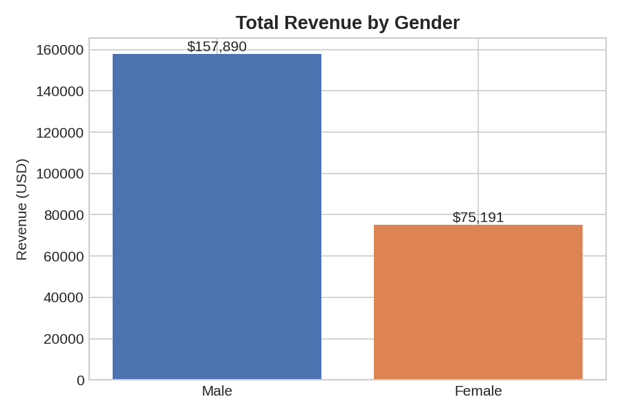
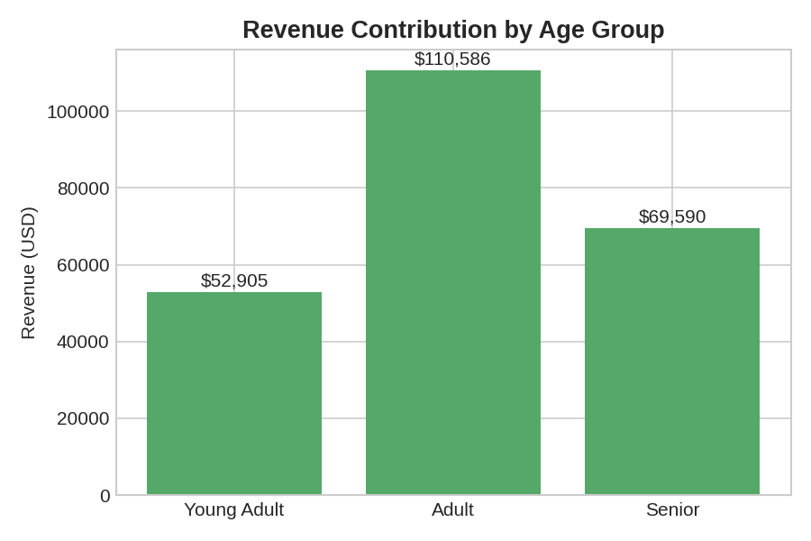
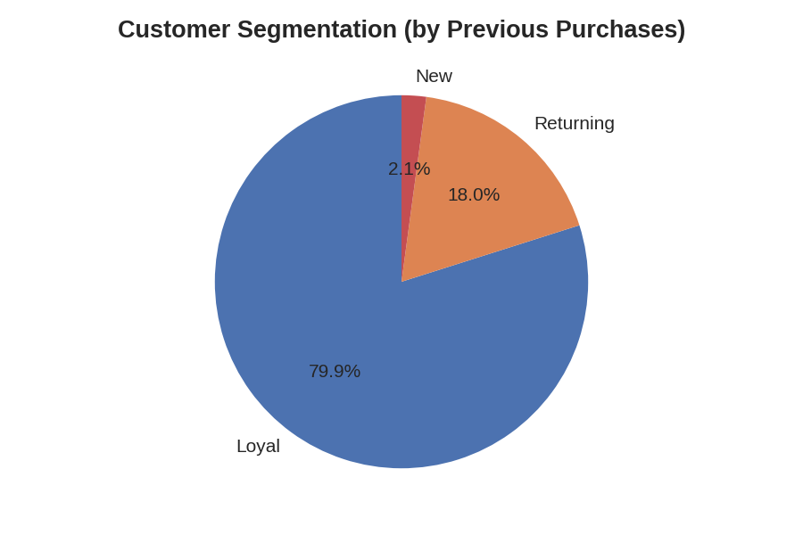

# Retail Customer Behaviour Analysis

An end-to-end analytics project on a retail customer shopping dataset — covering **data cleaning (Python)**, **business-question EDA (SQL)**, and an **interactive Power BI dashboard**, built around a real business problem: how a retail company can use its shopping data to improve engagement, loyalty, and marketing strategy.

## Business Problem

A retail company wants to understand shifting purchase patterns across demographics, product categories, and channels, and identify what drives repeat purchases — discounts, reviews, seasonality, or payment preferences. Full brief: [`Business Problem Document.pdf`](./Business%20Problem%20Document.pdf).

## Project Workflow

```
Raw CSV (3,900 rows, 18 columns)
        │
        ▼
Data Cleaning & Feature Engineering  →  Customer_Shopping_Behaviour_Analysis.ipynb
  • fill missing review ratings (category-wise median)
  • standardize column names
  • derive age_group buckets (Young / Young Adult / Adult / Senior)
  • map purchase frequency to numeric days
  • drop redundant promo_code_used column (100% identical to discount_applied)
        │
        ▼
Bulk-load into SQLite  →  optimize_insertion.py
  • WAL mode, chunked batch inserts, UNIQUE constraints
        │
        ▼
SQL-based EDA (10 business questions)  →  EDA.ipynb
        │
        ▼
Interactive Dashboard  →  PowerBI Dashboard/customerBehaviourDASHBoard.pbix
```

## Repo Structure

| File | Purpose |
|---|---|
| `Customer_Shopping_Behaviour_Analysis.ipynb` | Data cleaning, feature engineering, and loading into SQLite |
| `optimize_insertion.py` | Reusable helper for fast, chunked DataFrame → SQLite inserts |
| `EDA.ipynb` | 10 SQL business questions answered via `pandas.read_sql_query` |
| `dataset/customer_shopping_behavior.csv` | Raw dataset (3,900 customers, 18 fields) |
| `PowerBI Dashboard/customerBehaviourDASHBoard.pbix` | Interactive dashboard for stakeholders |
| `Business Problem Document.pdf` | Original business brief |

## Data Cleaning Highlights

- **Missing ratings** filled using the median rating *within each product category* (falls back to overall median if a category has no ratings at all) — avoids skewing categories with their own rating distribution.
- **Redundant column removed**: verified `discount_applied` and `promo_code_used` were identical across all 3,900 rows before dropping one.
- **Engineered features**: `age_group` (binned) and `frequency_purchase_days` (categorical frequency → numeric days), both used downstream in the SQL analysis.

## Key Business Questions Answered (SQL)

The EDA notebook answers 10 questions a retail stakeholder would actually ask, e.g.:

1. Total revenue by gender
2. Customers who used a discount but still spent above average
3. Top 5 products by average review rating
4. Standard vs. Express shipping — average spend comparison
5. Do subscribers spend more than non-subscribers?
6. Products with the highest % of discounted purchases
7. Customer segmentation: New / Returning / Loyal (by purchase history)
8. Top 3 products per category
9. Repeat buyers (5+ purchases) by subscription status
10. Revenue contribution by age group

Each is written as a standalone SQL query executed against the SQLite database, with results loaded straight into pandas for review.

## Sample Findings

**Male customers generated over 2x the revenue of female customers** in this dataset:



**Adults (30–55) are the largest revenue contributor**, roughly double the Young Adult segment:



**Customer base is heavily loyalty-weighted** — most customers have 10+ previous purchases:



*(Segment definition: New = 1 previous purchase, Returning = 2–10, Loyal = 10+)*

## Tech Stack

- **Python**: pandas for cleaning & feature engineering
- **SQLite + SQLAlchemy**: lightweight relational store for the SQL-analysis layer
- **SQL**: aggregations, CTEs, window functions (`ROW_NUMBER() OVER PARTITION BY`) for the top-N-per-category query
- **Power BI**: interactive dashboard for non-technical stakeholders

## How to Run

```bash
git clone https://github.com/nayak-siddarth/retail-customer-behaviour-analysis.git
cd retail-customer-behaviour-analysis
pip install pandas sqlalchemy jupyter

# 1. Clean data & load into SQLite
jupyter nbconvert --to notebook --execute Customer_Shopping_Behaviour_Analysis.ipynb

# 2. Run the SQL business-question analysis
jupyter nbconvert --to notebook --execute EDA.ipynb
```

Open `PowerBI Dashboard/customerBehaviourDASHBoard.pbix` in Power BI Desktop to explore the dashboard.

## License

See [LICENSE](./LICENSE).
